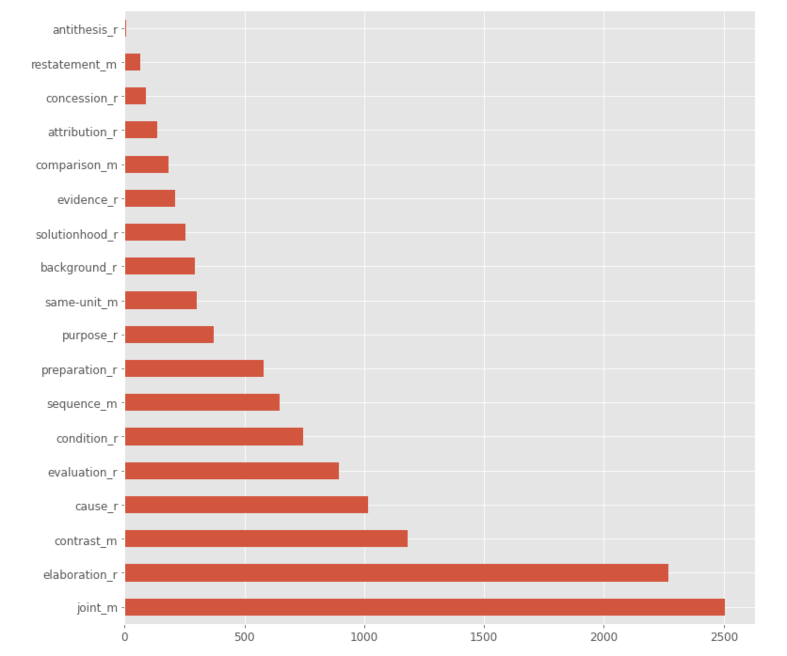
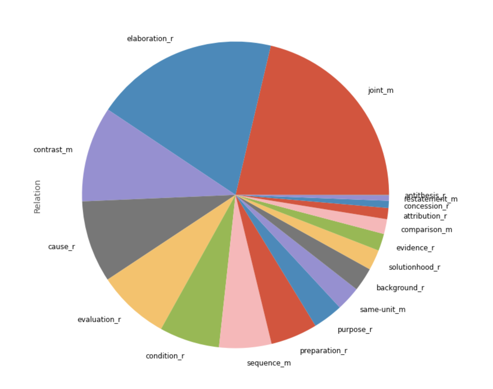
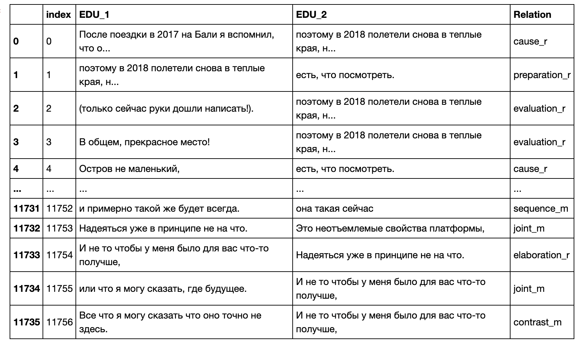
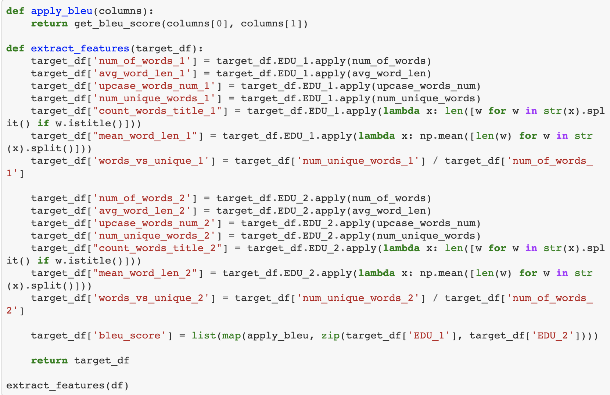
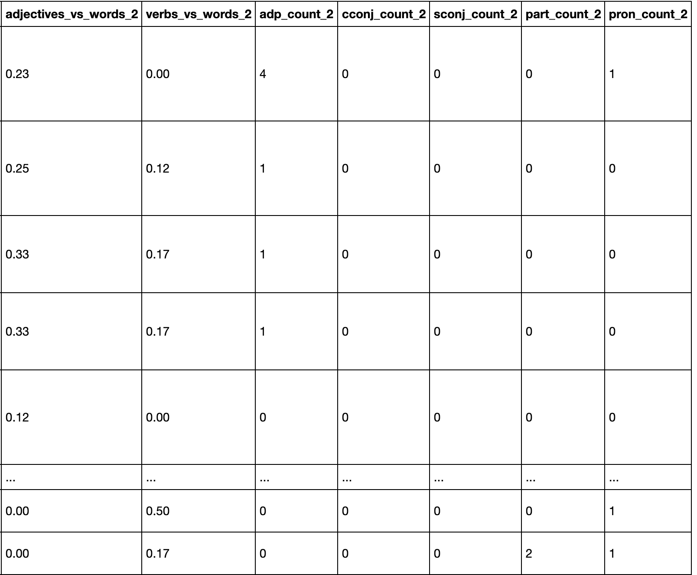
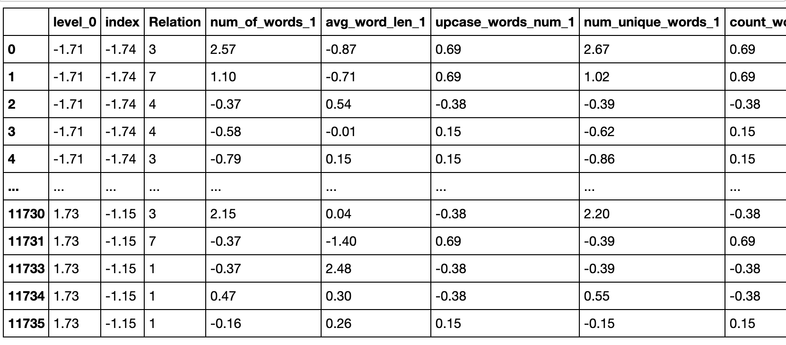
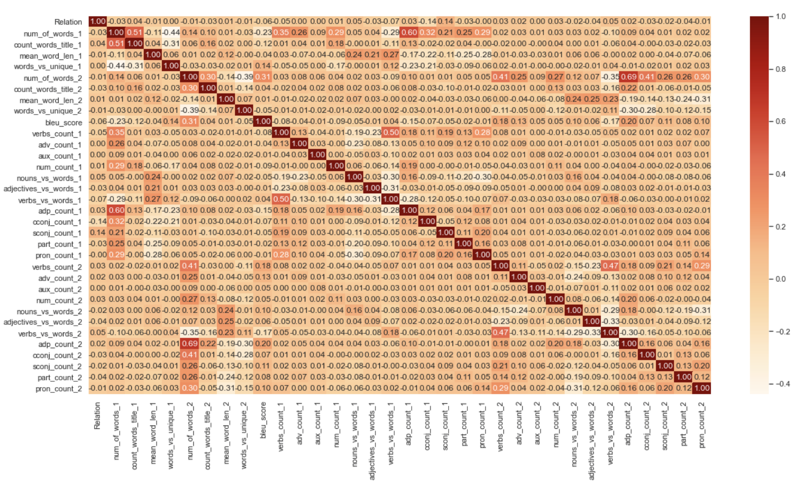
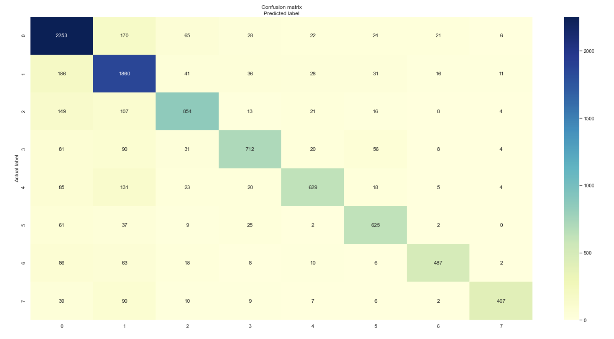
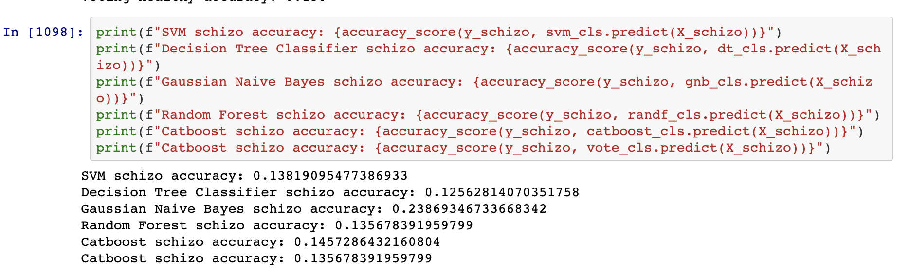

# rst_edus_classifier

RST-styled classifier of blogs for analyzing spoken data produced by people with schizophrenia

# How to use

Everything you need to run this application is located in `.ipynb`-files. In order to run the code it is necessary to install [`jupyter lab`](https://jupyter.org/) and run it firstly. For instance instructions for python3 and pip:

- `python3 -m pip install jupyterlab`
- `jupyter lab`

# Structure of the application

There are several different `.ipynb`-files each responsible for a single task. Every file install needed dependencies as you run it.

## `blogs_parser.ipynb`

Works with data from blogs:

- 1. Parses all dataset pieces with `rst2dep` package
- 2. Preprocesses EDU pairs in datasets
- 3. Merges all dataset pieces in one
- 4. Performs analytics on dataset such as distribution of most frequent EDUs, number of unique EDUs, etc.

Example of the outputs:

## `healthy_schizo_parser.ipynb`, `healthy_schizo_parser.ipynb`

Work basically in the same way as `blogs_parser.ipynb` do, have similar steps but work with different data and slightly different logic. The data is healthy pears and schizo pears respectively.

## `classifiers.ipynb` and `classifiers_3_rels.ipynb`

Each of the files contains main logic related to data processing, classifiers and analysis of the results. The difference is in the amount of relations used in classification process (The first one has 8 relations and the second one has only three).

Uses several packages:

- graphviz, matplotlib, seaborn to visualize the data
- numpy, pandas to cope with the data
- deeppavlov and nltk to extract the data from EDUs
- sklearn and catboost as classifiers implementation
- some internal python packages

Pipeline of the operations is the following:

- 1. Reading and merging the data. Resulting dataset:
     
- 2. Features extraction. Logic:
     
- 3. Features extraction with deeppavlov. Sample of the data:
     
- 4. Data preprocessing and key features extraction. Sample of the output:
     
- 5. Optimization of the correlation matrix. Resulting correlation matrix:
     
- 6. Building 5 types of classifiers and their verification. Example of the confusion matrix for a catboost classifier:
     
- 7. Schizo datasets analytics
- 8. Summarizing the classification results on the schizo dataset. Example of classification results:
     
- 9. Confusion matrix building and classification reports

## Datasets

In the `data` folder there are several subfolders for each of the schizo and healthy people:

- `rs3` contains source data
- `xml` contains source data in xml format
- `rsd` contains data parsed by rst2dep
- `processed` contains data in our internal format in order to operate with it
- `deeppavlov_parsed` contains data pased by deeppavlov

## Classifiers

Folder `classifiers` contains `.pkl`'s of the resulting classifiers in order to reproduce the results of this research.
